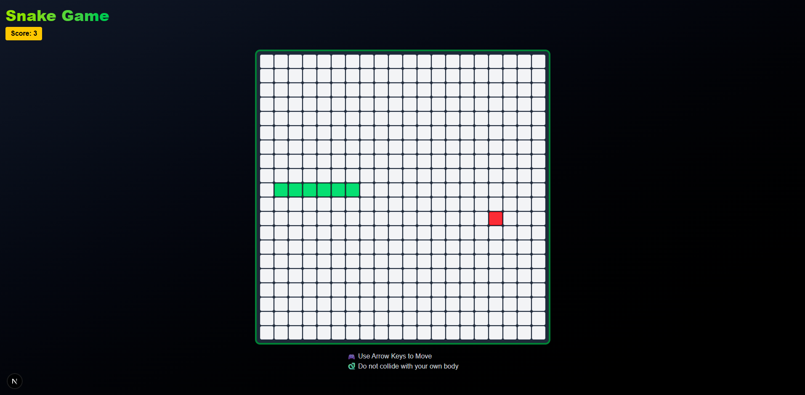

# 🐍 Snake Game

A classic Snake Game built using **Next.js**, **React**, **TypeScript**, and **Tailwind CSS**. Control the snake with your arrow keys, eat food to grow, and try not to crash into yourself!

👉 [Play it now!](https://snake-game-iota-kohl-31.vercel.app/)

## 🚀 Features

- Responsive game board using Tailwind's grid system
- Smooth movement and direction handling
- Collision detection (with self)
- Dynamic food generation
- Score counter
- Win and Game Over screens
- Clean UI with animations and styling via Tailwind

## 🎮 Controls

Use the **arrow keys** on your keyboard to control the snake:

- ⬆️ Up: `ArrowUp`
- ⬇️ Down: `ArrowDown`
- ⬅️ Left: `ArrowLeft`
- ➡️ Right: `ArrowRight`

## 🧠 Game Rules

- The snake moves in the direction you choose.
- If the snake eats the red square (food), it grows and your score increases.
- If it collides with its own body, the game ends.
- Fill the board to win!

## 🛠 Technologies

- **Next.js**
- **React**
- **TypeScript**
- **Tailwind CSS**
- `useEffect`, `useState`, `useCallback`, `useMemo`

## ▶️ Getting Started

### 1. Clone the repository

```bash
git clone https://github.com/lenizeramos/snake-game.git
cd snake-game
```
### 2. Install dependencies

```bash
npm install
```

### 3. Run the development server

```bash
npm run dev
```

Open your browser at [http://localhost:3000](http://localhost:3000)

## 📷 Screenshot



---

Enjoy the game and happy coding! 🕹️